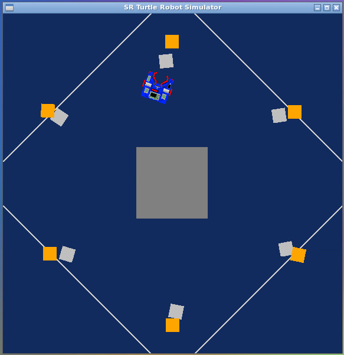

First assignment
================================

Installing and running
----------------------

The simulator requires a Python 2.7 installation, the [pygame](http://pygame.org/) library, [PyPyBox2D](https://pypi.python.org/pypi/pypybox2d/2.1-r331), and [PyYAML](https://pypi.python.org/pypi/PyYAML/).

Once the dependencies are installed, to run the script `assignment.py` in the simulator, use `run.py`, passing it the file name. You can find both files into [rt_firstassignment folder](https://github.com/SimoBor99/rt1_project/tree/main/rt_firstassignment).
By the command line, you can run it with:


```bash
$ python2 run.py assignment.py
```

Description
-----------------------------

The purpose of the script is to pair each silver token with a different golden. Firstly the robot has to find an unpaired silver token, grab it then find an unperaid gold token and, when it closes to it, release it and repeat the actions for every silver token. The important thing is that each silver has to be paired with only one gold token, there is no way for having two silvers or more paired with one gold. The final result is something like this



## Pseudocode

For achiving what I have written before, I have structured the code by using many functions for make it more modular and plainer. There are nine functions plus the main, that are explained by using pseudocode.

* **Drive**

```
Function drive:
	Pass as parametres speed and seconds
	No return value
	Use istance of class Robot for assigning speed to the power of motor0 and motor1
	Delay for the number of seconds
	Use istance of class Robot for setting 0 to the power of motor0 and motor1
```

* **Turn**

```
Function drive:
	Pass as parametres speed and seconds
	No return value
	Use istance of class Robot for assigning speed to the power of motor0 and - speed to motor1
	Delay for the number of seconds
	Use istance of class Robot for setting 0 to the power of motor0 and motor1
```

* **Find_token_silver**

```
Function find_token_silver:
	No parametres
	SET var dist_silver to 100
	SET var silver_token to false
	FOR each token in the method see, called by istance class of Robot
		DO
		IF the marker_type is equal to silver and the token distance is less than dist_silver:
			Assign token distance to dist_silver
			Assign token rot_y to rot_y_silver
			Assign the code of token to silver_number
			Assign true to silver_token
		ENDIF
	END FOR
	IF dist_silver is equal to 100 or silver_token is equal to false:
		RETURN -three times -1
	ENDIF
	ELSE:
		RETURN dist_silver, rot_y_silver and silver_number
	ENDELSE
```

* **Find_token_gold**

```
Function find_token_gold:
	No parametres
	SET var silver_gold to false
	FOR each token in the method see, called by istance class of Robot
		DO
		IF the marker_type is equal to gold:
			Assign token distance to dist_gold
			Assign token rot_y to rot_y_gold
			Assign the code of token to gold_number
			Assign true to gold_token
		ENDIF
	END FOR
	IF gold_token is equal to false:
		RETURN three times -1
	ENDIF
	ELSE:
		RETURN dist_gold, rot_y_gold and silver_gold
	ENDELSE
```

* **Align_to_silver**

```
Function align_to_silver:
	Pass as parametres dist_silver and rot_y_silver
	SET var silver_grab to false
	IF dist_silver is equal to -1:
		Call the function turn with parametres 5 and 1
	ENDIF
	ELSE:
		IF dist_silver is less than d_th:
			Print "found the silver"
			IF it grab the silver:
				Print "gotcha"
				Assign true to silver_grab
			ENDIF
		ENDIF
		IF rot_y_silver is grater equal than -a_th and less equal than a_th:
			Print "Ah, here we are!"
			Call the function drive with parametres 30 and 0.5
		ENDIF
		IF rot_y_silver is less than -a_th:
			Print "Left a bit for the silver"
			Call the function turn with parametres -3 and 0.2
		ENDIF
		IF rot_y_silver is grater than a_th:
			Print "Right a bit for the silver"
			Call the function turn with parametres 3 and 0.2
		ENDIF
	END ELSE
	RETURN silver_grab
```

* **Align_to_gold**

```
Function align_to_silver:
	Pass as parametres dist_gold and rot_y_gold
	SET var gold_reach to false
	IF dist_gold is equal to -1:
		Call the function turn with parametres 5 and 1
	ENDIF
	ELSE:
		IF dist_gold is less than 1.6 multiplied by d_th:
			Print "found the gold"
			IF it release the silver:
				Print "release"
				Assign true to gold_reach
			ENDIF
		ENDIF
		IF rot_y_gold is grater equal than -a_th and less equal than a_th:
			Print "Ah, here we are!"
			Call the function drive with parametres 30 and 0.5
		ENDIF
		IF rot_y_gold is less than -a_th:
			Print "Left a bit for the gold"
			Call the function turn with parametres -3 and 0.2
		ENDIF
		IF rot_y_gold is grater than a_th:
			Print "Right a bit for the gold"
			Call the function turn with parametres 3 and 0.2
		ENDIF
	END ELSE
	RETURN gold_reach
```

* **Check_paired_silver**

```
Function check_paired_silver:
	Pass as arguments parray_silver and silver_number
	SET var paired to false
	SET var j to 0
	WHILE j is less than 6:
		IF the j element of parray_silver is equal to silver_number:
			Print "Token paired silver found"
			Call the function turn with parametres 10 and 2
			Assign true to paired
			Interrupt the loop
		ENDIF
		Add one to j
	END WHILE
	RETURN paired
```

* **Check_paired_gold**

```
Function check_paired_gold:
	Pass as arguments parray_gold and gold_number
	SET var paired to false
	SET var j to 0
	WHILE j is less than 6:
		IF the j element of parray_gold is equal to silver_number:
			Print "Token paired gold found"
			Call the function turn with parametres 10 and 2
			Assign true to paired
			Interrupt the loop
		ENDIF
		Add one to j
	END WHILE
	RETURN paired
```

* **Paired_tokens**

```
Function paired_tokens:
	Pass as arguments parray_silver, silver_number, parray_gold, gold_number and count_pair
	Assign silver_number to the count_pair element of parray_silver 
	Assign gold_number to the count_pair element of parray_gold
	Add one to count_pair
	IF count_pair is equal to 6:
		Print "Finish, every silver token is paired
		Call the function drive with parametres -20 and 1
		Exit
	ENDIF
	ELSE:
		Call the function drive with parametres -20 and 1
		Call the function turn with parametres 25 and 2
	END ELSE
	RETURN count_pair
```
	
* **Main**

```
Function main:
	SET var parray_silver[6] to 0
	SET var parray_gold[6] to 0
	SET var count_pair to 0
	SET var silver_avaible to true
	SET var silver_taken to false
	SET var gold_reach to false
	WHILE true:
		IF silver_avaible is equal to true:
			Call the function find_token_silver
			Assign the return values of find_token_silver to dist_silver, rot_y_silver, number_silver
			Print "dist_silver", "rot_y_silver" and "silver_number"
			Call the function check_paired_silver with arguments parray_silver, number_silver
			Assign the return value of check_paired_silver to paired_silver 
			IF paired_silver is equal to false and find_token_silver has not returned -1:
				Call the function align_to_silver with arguments dist_silver, rot_y_silver
				Assign the return value of find_token_silver to silver_taken
			ENDIF
			ELSE:
				IF find_token_silver has returned -1:
					Call the function turn with arguments 7 and 1
				ENDIF
			ENDELSE	
		ENDIF
		IF silver_taken is equal to true:
			Assign false to silver_avaible
			Assign the return values of find_token_gold to dist_gold, rot_y_gold and number_gold
			Print "dist_gold", "rot_y_gold", and "number_gold"
			Call the function check_paired_gold with arguments parray_gold, number_gold
			Assign the return value of check_paired_gold to paired_gold
			IF paired_gold is equal to false and find_token_gold has not returned -1:
				Call the function align_to_gold with arguments dist_gold, rot_y_gold
				Assign the return value of find_token_gold to gold_reach
			ENDIF
			ELSE:
				IF find_token_gold has returned -1:
					Call the function turn with arguments 7 and 1
				ENDIF
			ENDELSE
			IF gold_reach is equal to true:
				Call the function paired_tokens with arguments parray_silver, silver_number, parray_gold, gold_number and count_pair
				Assign the return value of paired_tokens to count_pair
				Assign true to silver_avaible 
				Assign false to silver_taken
				Assign false to gold_reach
			ENDIF
		ENDIF
	END WHILE
```		

Possible improvements
-------------------------------------

Although there are no specific constraints of which silver or gold token has to be found by robot ( i.g.: the closest or the farest), my solution implements that every time it finds the closest silver. but not the golden. So one possible improvement is to accomplish not only the former, but also the latter. For doing that, when the robot grabs the silver, it has to rotate until find the nearest golden. 

Another possible improvement is to make the stop condition of the loop more "general"; in fact the while loop stops when the robot pairs the sixth silver block with the sixth gold one, but what happens if one more pair is added? The robot doesn't recognize the new blocks unless I change the value of variable **count_pair** in the function `paired_tokens`. 


	


